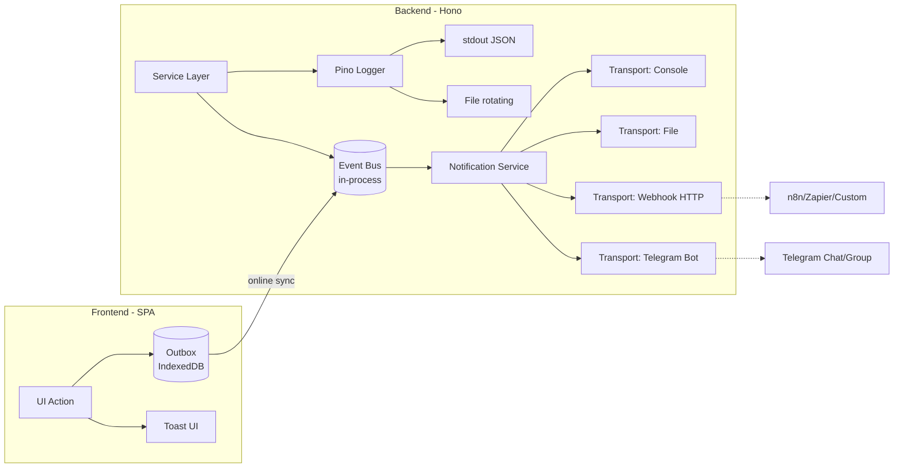
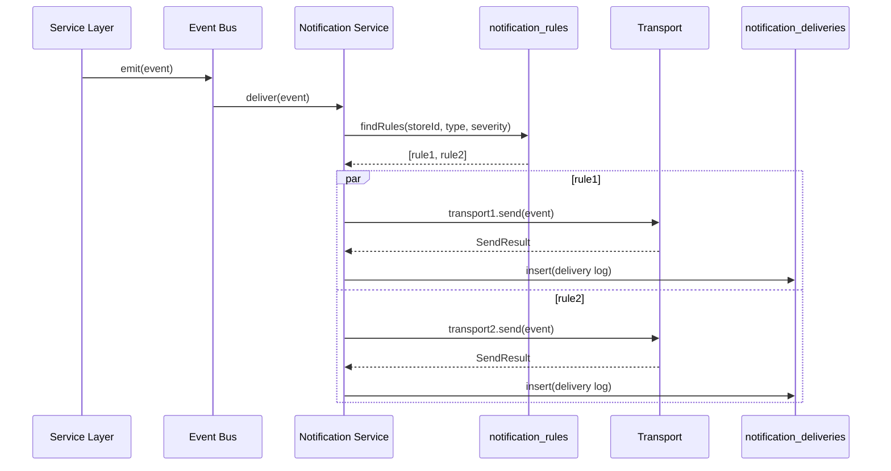
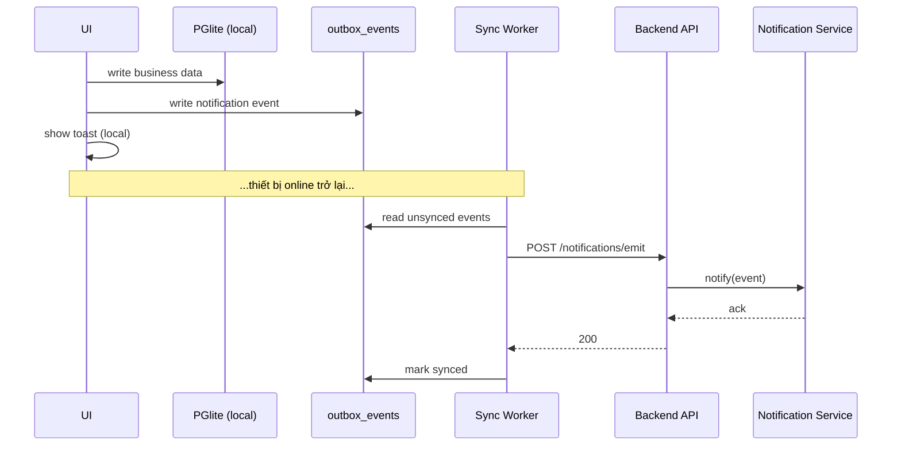

# Observability & Notifications

> **Scope**: Định nghĩa hệ thống logging, alerting và notification đa kênh cho KiotViet Lite. Bổ sung cho `core-architectural-decisions.md` (không thay thế). Tập trung cho MVP 1 cửa hàng, thiết kế pluggable để mở rộng sau.

## 1. Bối cảnh và vấn đề

### Khổ đế (vấn đề cụ thể)

Kiến trúc hiện tại có 3 mảnh rời:

- `audit_logs` (DB) cho log nghiệp vụ.
- Sentry cho error tracking runtime.
- react-hot-toast cho user feedback UI.

Thiếu 3 năng lực thực tế đã hình dung:

1. **Structured logging** ở backend (Hono API) với log level, format JSON, tương thích aggregation tool.
2. **Notification đa transport** (console, file, webhook, Telegram) cho cảnh báo ra ngoài.
3. **Alert rule** tối thiểu (event → điều kiện → kênh).

### Tập đế (gốc rễ)

Scope MVP ban đầu chỉ tối ưu cho 1 cửa hàng offline-first. Ở quy mô đó, toast + Sentry là "đủ". Khi thêm nghiệp vụ nhạy cảm (đơn giá trị lớn, sync thất bại lặp, override nợ, tồn kho âm), chủ cửa hàng cần kênh push chủ động (Telegram phổ biến nhất ở VN cho shop nhỏ).

## 2. Quyết định tổng thể

Tách thành 2 lớp độc lập:

| Lớp | Vai trò | Công nghệ |
| --- | --- | --- |
| **Logger nền** | Ghi log có cấu trúc cho dev/ops | Pino 9.x (backend), console (frontend) |
| **Notification Service** | Route event tới transport theo rule | Module custom (`packages/notifications`) |

Hai lớp không phụ thuộc nhau. Logger ghi xuống stdout/file. Notification Service subscribe vào event bus nghiệp vụ (không phải log stream). Phân tách này tránh lẫn lộn "log cho máy đọc" và "alert cho người đọc".



## 3. Backend: Notification Service

### 3.1. Vị trí trong codebase

```
packages/notifications/
├── src/
│   ├── index.ts                 # Public API: notify(event)
│   ├── event-schema.ts          # Zod schemas cho NotificationEvent
│   ├── router.ts                # Map event → channels theo rule
│   ├── transports/
│   │   ├── base.ts              # Interface Transport
│   │   ├── console.ts
│   │   ├── file.ts
│   │   ├── webhook.ts
│   │   └── telegram.ts
│   └── formatters/              # Render event → text/markdown/JSON
└── package.json
```

Gọi từ `apps/server/src/services/*` qua `notify(event)`. Không gọi trực tiếp transport.

### 3.2. Transport interface

```ts
// packages/notifications/src/transports/base.ts
export interface Transport {
  readonly name: 'console' | 'file' | 'webhook' | 'telegram';
  readonly config: TransportConfig;
  send(event: NotificationEvent): Promise<SendResult>;
}

export type SendResult =
  | { ok: true; attempts: number }
  | { ok: false; error: string; attempts: number; retriable: boolean };
```

Mọi transport tuân thủ interface này. Thêm kênh mới (Slack, email, Zalo OA) chỉ cần implement `Transport`, không động router.

### 3.3. Event schema

```ts
// Zod schema (shared)
export const NotificationEventSchema = z.object({
  id: z.string().uuid(),           // uuid v7
  storeId: z.string().uuid(),      // multi-tenant key
  type: NotificationTypeEnum,      // enum, xem Event Catalog
  severity: z.enum(['info', 'warn', 'error', 'critical']),
  title: z.string().max(200),
  body: z.string().max(2000),
  context: z.record(z.unknown()).optional(),  // payload tự do, redact secret
  occurredAt: z.string().datetime(),
  correlationId: z.string().optional(),       // trace với request log
});
```

`storeId` bắt buộc. Mọi event luôn gắn store để router biết lấy cấu hình kênh nào.

### 3.4. Router và rule

Rule lưu trong DB, không hard-code:

```
bảng: notification_rules
├── id (uuid v7)
├── store_id (FK)
├── event_type (enum)
├── min_severity (enum)
├── channel_id (FK → notification_channels)
├── enabled (bool)
├── throttle_seconds (int, default 0)  -- chống spam
└── created_at
```

Flow: `notify(event)` → router query rule theo `store_id + type + severity` → fan-out tới các channel match → mỗi channel gọi transport tương ứng → kết quả ghi vào `notification_deliveries`.

## 4. Frontend: Notification Adapter

### 4.1. Nguyên tắc

Frontend **KHÔNG** gọi Telegram/webhook trực tiếp. Lý do:

- Offline-first: khi mất mạng, gọi thẳng transport sẽ fail.
- Security: token Telegram/URL webhook không được lộ ra client.
- Audit: mọi notification phải đi qua backend để log vào `notification_deliveries`.

### 4.2. Outbox pattern

```
User action (POS/Nhập hàng/…)
  → Local DB (PGlite) + write vào bảng `outbox_events`
  → Toast UI ngay (phản hồi tức thì)
  → Khi online → sync worker đẩy event qua API `POST /api/notifications/emit`
  → Backend validate + enqueue vào Event Bus → Notification Service
```

Bảng `outbox_events` ở PGlite client-side:

```
├── id (uuid v7)
├── type
├── payload (JSON)
├── created_at
├── synced_at (nullable)
└── retry_count
```

Sync worker xoá row sau khi server ack. Tối đa 7 ngày giữ lại, quá thì archive local.

### 4.3. Phân biệt 3 loại thông báo client

| Loại | Phạm vi | Công nghệ |
| --- | --- | --- |
| **Toast** | Chỉ user hiện tại | react-hot-toast |
| **In-app inbox** | Tất cả user cùng store | Query `notifications` table qua API |
| **External push** | Ngoài hệ thống (Telegram…) | Outbox → Backend → Transport |

Toast không cần outbox. Inbox lấy từ backend. External push mới cần outbox.

## 5. Multi-tenant config

### 5.1. Bảng `notification_channels`

Mỗi store tự cấu hình kênh riêng (chủ shop nhập Telegram bot token của mình):

```
├── id (uuid v7)
├── store_id (FK)
├── transport ('console' | 'file' | 'webhook' | 'telegram')
├── name (vd: "Chủ shop Telegram", "Kế toán Webhook")
├── config_encrypted (JSONB, mã hoá AES-256-GCM)
├── enabled (bool)
├── created_at, updated_at
```

Config mẫu theo transport (sau khi giải mã):

```json
// telegram
{ "botToken": "123:ABC", "chatId": "-100..." }

// webhook
{ "url": "https://...", "method": "POST", "headers": {...}, "hmacSecret": "..." }

// file
{ "path": "/var/log/kvl/notifications.log", "rotation": "daily", "maxSize": "10MB" }

// console
{ "colorize": true, "minSeverity": "info" }
```

### 5.2. Mã hoá

Token và secret lưu ciphertext. Key mã hoá: env var `NOTIFICATION_CONFIG_KEY` (32 byte, random). Rotation key 6 tháng. Decrypt chỉ trong Notification Service runtime, không trả về client.

## 6. Event Catalog khởi tạo

Bắt đầu hẹp, mở rộng theo nhu cầu. MVP cover 7 event critical:

| Type | Severity | Trigger | Transport mặc định |
| --- | --- | --- | --- |
| `auth.login.suspicious` | warn | Login từ IP/UA bất thường | Telegram |
| `auth.pin.locked` | warn | PIN sai 5 lần | Telegram |
| `order.high_value` | info | Đơn > ngưỡng cấu hình (vd 5 triệu) | Telegram |
| `stock.negative` | error | Tồn kho âm sau giao dịch | Telegram + Webhook |
| `sync.failed_repeatedly` | error | Sync fail 3 lần liên tiếp | Telegram + Webhook |
| `audit.price_override` | warn | Sửa giá dưới vốn | Telegram |
| `system.error.unhandled` | critical | Exception không bắt (kèm Sentry) | Console + File + Telegram |

Event type theo namespace `<domain>.<action>[.<qualifier>]`. Thêm event mới: cập nhật enum + Zod schema + bảng catalog này.

## 7. Logger nền (Pino)

Tách hoàn toàn với Notification Service. Vai trò: ghi structured log cho ops/debug.

### 7.1. Backend (Hono)

```ts
import pino from 'pino';

export const logger = pino({
  level: process.env.LOG_LEVEL ?? 'info',
  formatters: { level: (label) => ({ level: label }) },
  timestamp: pino.stdTimeFunctions.isoTime,
  redact: ['req.headers.authorization', '*.password', '*.pin', '*.botToken'],
});
```

- Output: stdout JSON (production), pino-pretty (dev).
- Level: `trace | debug | info | warn | error | fatal`.
- Redact: tự động bỏ field nhạy cảm.
- Correlation: middleware inject `requestId` (uuid v7) vào mọi log line + header response.

### 7.2. File rotation

Dùng `pino.multistream` + `pino-roll`:

```
/var/log/kvl/app-2026-04-24.log
/var/log/kvl/app-2026-04-25.log
...
```

Rotate theo ngày, giữ 30 ngày, max 100MB/file. Chạy Railway/Fly.io thì file ephemeral, cần mount volume riêng hoặc ship sang object storage. Quyết định cụ thể ship sang Cloudflare R2 mỗi ngày (cron job).

### 7.3. Frontend

Dev: `console.*`. Production: giữ `console.error` + `console.warn`, nuốt `console.log/debug` (Vite build plugin). Error thực sự vẫn đi Sentry như cũ.

## 8. Luồng xử lý chi tiết

### 8.1. Event từ backend



### 8.2. Event từ frontend (offline)



## 9. Retry, throttle, dead-letter

- **Retry**: mỗi transport tự định retry policy. Webhook/Telegram: 3 lần, exponential backoff (1s, 4s, 16s).
- **Throttle**: theo rule (`throttle_seconds`). Ví dụ `order.high_value` throttle 300s = không spam quá 1 notification/5 phút cùng type cùng store.
- **Dead-letter**: fail sau retry → row `notification_deliveries` với `status='dead'`. Hàng ngày cron quét dead-letter, gửi summary qua Telegram cho admin.

## 10. Security

- Webhook outbound: ký HMAC-SHA256 header `X-KVL-Signature` bằng secret per-channel. Receiver verify trước khi xử lý.
- Telegram bot token: chỉ decrypt trong Notification Service, không trả về client, không log ra stdout (nhờ `redact` Pino).
- Rate-limit endpoint `/api/notifications/emit` theo JWT user: 60 req/phút.
- Không cho phép client chỉ định transport hoặc override rule. Client chỉ emit event type đã whitelist.

## 11. Quy ước và enforcement

Thêm vào `implementation-patterns-consistency-rules.md`:

1. Mọi notification phải qua `notify(event)` của `packages/notifications`, **cấm** gọi trực tiếp HTTP/Telegram từ service khác.
2. Event type mới phải bổ sung enum + Zod schema + mục Event Catalog trong ADR này.
3. Config channel (token, URL) **bắt buộc** lưu mã hoá, không để plaintext trong DB/log.
4. Redact rule Pino phải phủ mọi field token/password/pin/secret. Thêm trường nhạy cảm mới thì cập nhật redact.
5. Frontend **cấm** gọi transport trực tiếp. Luôn đi qua outbox + backend API.

## 12. Technology stack

| Thành phần | Công nghệ | Phiên bản |
| --- | --- | --- |
| Logger backend | Pino | 9.x |
| Log rotation | pino-roll | 3.x |
| HTTP client (webhook) | undici (native) | Node 20+ |
| Telegram Bot | grammy | 1.x |
| Encryption | node:crypto (AES-256-GCM) | Node 20+ |
| Validation | Zod (shared) | 3.x |

Không thêm thư viện notification framework (node-notifier, Apprise wrapper…). Tự viết mỏng, kiểm soát dependency.

## 13. Hệ quả (nhân duyên quả)

### Quả gần (tích cực)

- Chủ cửa hàng nhận alert real-time qua Telegram, phát hiện bất thường trong phút.
- Dev có structured log JSON → dễ grep, dễ ship sang Loki/Datadog sau này mà không refactor.
- Thêm transport mới (Slack, Zalo, email) không động code service nghiệp vụ.

### Quả xa (cần lường)

- Thêm 2 bảng DB (`notification_channels`, `notification_rules`, `notification_deliveries`) cộng thêm outbox client. Migration + admin UI tốn effort.
- Vận hành Telegram bot token per-store yêu cầu onboarding: chủ shop phải tự tạo bot, nhập token. Cần flow UX rõ ràng (epic mới?).
- File log trên Railway/Fly ephemeral → phải có cron ship sang R2, không được quên khi deploy lần đầu.
- Throttle + dead-letter cần dashboard quan sát, nếu không delivery fail âm thầm.

### Nợ kỹ thuật chấp nhận ở MVP

- Chưa có UI admin quản lý rule (config qua SQL trực tiếp hoặc API nội bộ).
- Chưa có metrics (Prometheus) cho delivery rate/latency. Khi scale sẽ cần thêm.
- Event Catalog mới 7 item, sẽ mở rộng khi user feedback.

## 14. Checklist validation

- [ ] `packages/notifications` tạo xong với 4 transport chạy được.
- [ ] Pino logger wire vào Hono middleware, log có `requestId`.
- [ ] Migration cho `notification_channels`, `notification_rules`, `notification_deliveries`.
- [ ] Migration `outbox_events` ở PGlite client.
- [ ] Sync worker xử lý outbox có unit test.
- [ ] Smoke test: emit `stock.negative` → nhận được message Telegram trong < 5s.
- [ ] Security review: AES key rotation procedure có tài liệu.
- [ ] Update `core-architectural-decisions.md` mục "Monitoring" → link sang ADR này.

## 15. Tham chiếu

- `core-architectural-decisions.md`: Infrastructure & Deployment, Authentication & Security.
- `implementation-patterns-consistency-rules.md`: Error Handling, Enforcement Guidelines.
- Sentry vẫn giữ cho error tracking runtime, KHÔNG thay thế. Notification Service bổ sung lớp alert nghiệp vụ phía trên.
