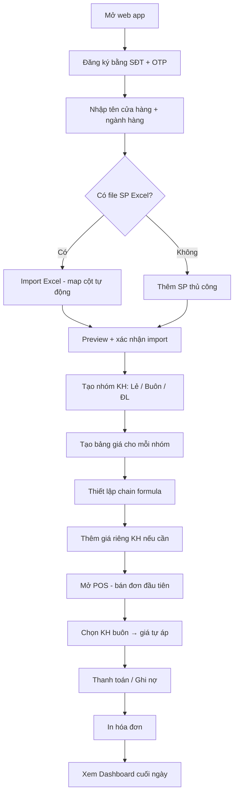
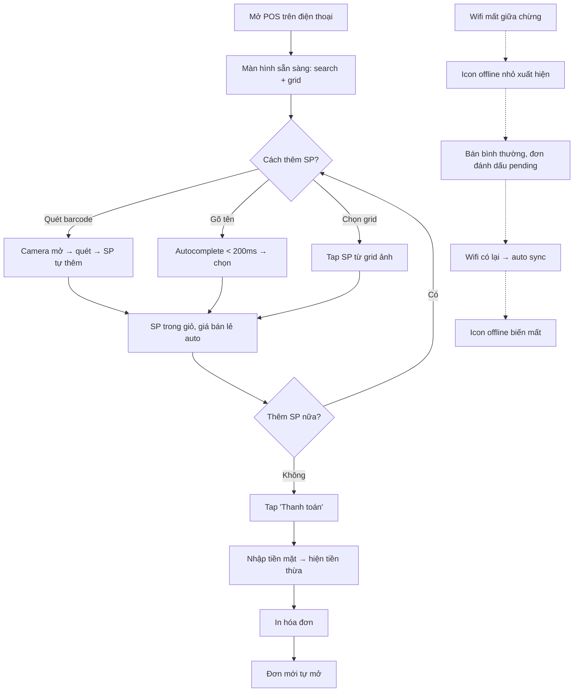
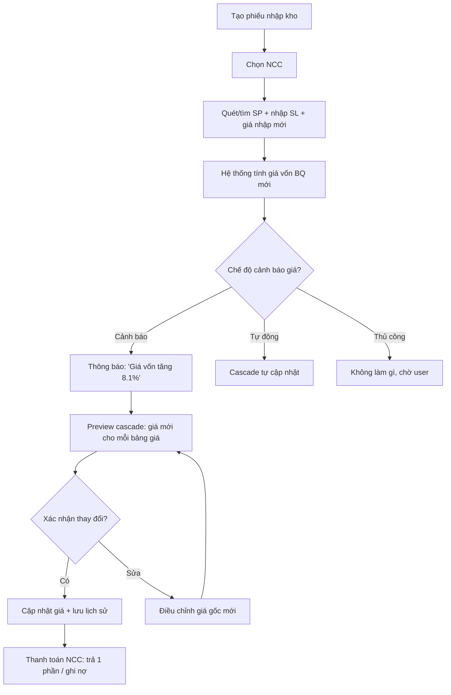
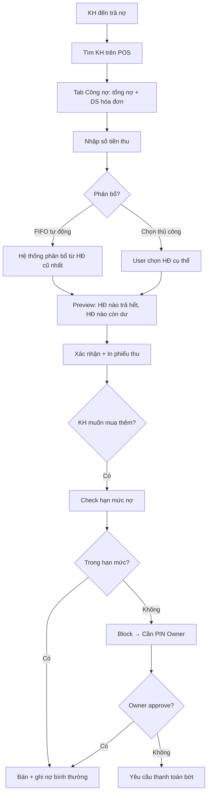

# UX Design Specification — KiotViet Lite

**Author:** shun
**Date:** 2026-04-18

---

## Executive Summary

### Tầm nhìn sản phẩm

KiotViet Lite là phần mềm quản lý bán hàng (POS) dành riêng cho hộ kinh doanh nhỏ tại Việt Nam (1-5 nhân viên). Sản phẩm tập trung vào hai mô hình bán buôn và bán lẻ, giải quyết 3 pain point lớn nhất: (1) lên đơn nhanh với giá đúng, (2) quản lý công nợ minh bạch, (3) biết lãi lỗ tồn kho chính xác.

Triết lý thiết kế: **ít hơn = tốt hơn**. Mỗi màn hình chỉ làm 1 việc. Mọi thao tác bán hàng hoàn thành trên điện thoại. Bán hàng không cần internet. Từ đăng ký đến bán hàng đầu tiên ≤ 5 phút.

### Người dùng mục tiêu

| Persona                        | Đặc điểm                                                                                                  | Nhu cầu UX chính                                                         |
| ------------------------------ | --------------------------------------------------------------------------------------------------------- | ------------------------------------------------------------------------ |
| **Chủ cửa hàng nhỏ** (chị Hoa) | 35-45 tuổi, 1-5 NV, bán tạp hóa/VLXD/thời trang. Hiện dùng sổ tay + Excel. Trình độ công nghệ trung bình. | Tổng quan nhanh (doanh thu, lãi lỗ, nợ), quản lý giá linh hoạt, setup dễ |
| **Nhân viên bán hàng** (Lan)   | 20-30 tuổi, dùng smartphone OK nhưng chưa dùng POS. Cần training ≤ 30 phút.                               | Lên đơn nhanh ≤ 30s, không cần nhớ giá, giao diện đơn giản               |
| **Khách buôn** (anh Minh)      | Đại lý cấp 2, mua SL lớn, trả nợ dần. Cần hóa đơn rõ ràng.                                                | Thấy rõ giá buôn, nợ cũ/mới, lịch sử thanh toán                          |


### Thách thức thiết kế chính

1. **Hệ thống 6 tầng giá phức tạp** — phải trình bày đơn giản cho nhân viên (auto-áp giá) nhưng linh hoạt cho chủ cửa hàng (cấu hình cascade, chain formula)
2. **Offline-first trên mobile** — toàn bộ luồng bán hàng phải mượt khi mất mạng, sync trạng thái phải rõ ràng không gây hoang mang
3. **Đa dạng trình độ người dùng** — nhân viên cần giao diện tối giản, chủ cửa hàng cần báo cáo + cấu hình nâng cao, cùng 1 ứng dụng
4. **Công nợ tích hợp sâu** — ghi nợ, thu nợ, FIFO, hạn mức phải tự nhiên trong luồng bán hàng, không phải module tách biệt

### Cơ hội thiết kế

1. **5-phút onboarding** — trải nghiệm setup đơn giản hơn hẳn KiotViet/Sapo tạo ấn tượng mạnh ngay lần đầu
2. **POS mobile-first thực sự** — đối thủ thiết kế cho desktop rồi responsive, KiotViet Lite thiết kế cho mobile trước
3. **Hiển thị nguồn giá minh bạch** — nhân viên thấy "Giá riêng KH" hay "Giá ĐL C1" cạnh mỗi dòng, tăng tin tưởng và giảm hỏi chủ

---

## Core User Experience

### Trải nghiệm định nghĩa sản phẩm

**"Quét — Chọn KH — Thanh toán. 30 giây. Giá đúng. Nợ rõ."**

Trải nghiệm cốt lõi của KiotViet Lite là luồng bán hàng trên POS. Nếu nail được 1 thứ duy nhất, đó là: nhân viên quét barcode hoặc gõ tên sản phẩm → hệ thống tự áp giá đúng theo khách hàng → thanh toán hoặc ghi nợ → in hóa đơn → đơn mới tự mở. Toàn bộ ≤ 30 giây cho 3-5 sản phẩm.

### Chiến lược nền tảng

| Yếu tố            | Quyết định                                                     |
| ----------------- | -------------------------------------------------------------- |
| Nền tảng          | PWA (Progressive Web App) — web-based, installable trên mobile |
| Input chính       | Touch (mobile/tablet) + keyboard shortcuts (desktop)           |
| Thiết kế đầu tiên | Mobile-first (≥ 375px), scale lên tablet/desktop               |
| Offline           | 100% bán hàng offline, sync khi có mạng                        |
| Camera            | Quét barcode bằng camera điện thoại                            |
| In ấn             | Thermal printer 58/80mm (ESC/POS) + A4/A5                      |


### Tương tác không cần suy nghĩ

Những thao tác phải hoàn toàn tự nhiên, không cần training:

1. **Quét barcode → sản phẩm tự thêm vào giỏ** — không cần bước trung gian
2. **Chọn khách hàng → giá tự đổi** — nhân viên không cần nhớ ai được giá nào
3. **Mất mạng → bán bình thường** — không popup, không warning, chỉ icon nhỏ "offline"
4. **Có mạng lại → tự sync** — không cần bấm gì, đơn pending tự lên server
5. **Thanh toán xong → đơn mới tự mở** — zero-click cho đơn tiếp theo
6. **Nhập tiền mặt → tự tính tiền thừa** — hiển thị lớn, rõ

### Khoảnh khắc thành công quan trọng

| Khoảnh khắc                    | Mô tả                                         | Chỉ số                   |
| ------------------------------ | --------------------------------------------- | ------------------------ |
| **"Nó nhanh thật!"**           | Nhân viên hoàn thành đơn đầu tiên trong ≤ 30s | Thời gian đơn hàng < 30s |
| **"Giá đúng rồi!"**            | Chọn KH buôn → giá tự đổi, không cần hỏi chủ  | 0 lần hỏi giá/ngày       |
| **"Wifi mất mà vẫn bán được"** | POS hoạt động bình thường khi offline         | 0 đơn bị mất             |
| **"Biết ai nợ bao nhiêu"**     | Dashboard công nợ 1 click                     | Thời gian xem nợ < 5s    |
| **"5 phút là bán hàng được"**  | Từ đăng ký → bán đơn đầu tiên                 | Setup time ≤ 5 phút      |


### Nguyên tắc trải nghiệm

1. **Tốc độ trên hết** — mọi thao tác bán hàng phải cảm thấy tức thì. Autocomplete < 200ms, tạo đơn < 500ms
2. **Không bất ngờ** — hệ thống luôn cho biết nguồn giá, trạng thái sync, nợ hiện tại. Minh bạch tạo tin tưởng
3. **Touch-first, keyboard-enhanced** — thiết kế cho ngón tay, tối ưu thêm cho bàn phím (F2 thanh toán, F4 ghi nợ)
4. **Progressive disclosure** — nhân viên thấy POS đơn giản, chủ cửa hàng unlock thêm cấu hình/báo cáo
5. **Offline là bình thường** — offline không phải trạng thái lỗi, mà là trạng thái vận hành bình thường

---

## Desired Emotional Response

### Mục tiêu cảm xúc chính

| Cảm xúc                | Khi nào                                             | Thiết kế hỗ trợ                                 |
| ---------------------- | --------------------------------------------------- | ----------------------------------------------- |
| **Tự tin & kiểm soát** | Nhân viên bán hàng không cần hỏi chủ về giá         | Nguồn giá hiển thị rõ cạnh mỗi dòng SP          |
| **Nhẹ nhõm**           | Chủ cửa hàng biết chính xác lãi lỗ, ai nợ bao nhiêu | Dashboard tổng quan, số liệu real-time          |
| **Hiệu quả**           | Hoàn thành đơn hàng nhanh hơn sổ tay                | Animation nhanh, feedback tức thì               |
| **An toàn**            | Bán hàng offline, dữ liệu không mất                 | Trạng thái sync rõ ràng, icon offline nhẹ nhàng |


### Bản đồ cảm xúc theo hành trình

```
Phát hiện app → Tò mò, hơi nghi ngờ
     ↓
Setup 5 phút → Bất ngờ ("Nhanh thật!")
     ↓
Bán đơn đầu tiên → Hào hứng + Tự tin
     ↓
Giá tự áp đúng → Tin tưởng ("Nó thông minh")
     ↓
Offline vẫn OK → An tâm
     ↓
Xem báo cáo cuối ngày → Nhẹ nhõm, kiểm soát
     ↓
Quay lại ngày mai → Quen thuộc, hiệu quả
```

### Vi cảm xúc cần chú ý

- **Tự tin > Bối rối** — nhân viên mới phải tự tin bán hàng sau 30 phút training. Giao diện phải tự giải thích
- **Tin tưởng > Nghi ngờ** — giá hiển thị phải rõ nguồn, nợ phải khớp, tồn kho phải chính xác
- **Thành tựu > Nản chí** — mỗi đơn xong có feedback tích cực nhẹ (animation check), không để user thấy "thêm 1 đơn nữa phải làm"
- **Bình tĩnh > Hoang mang** — khi offline, khi sync conflict, khi nợ vượt hạn mức — hệ thống xử lý nhẹ nhàng, không la lối

### Nguyên tắc thiết kế cảm xúc

1. **Feedback tức thì** — mọi thao tác đều có phản hồi trong < 100ms (haptic, visual, sound)
2. **Lỗi không đáng sợ** — error messages dùng ngôn ngữ bình thường, gợi ý cách sửa, không dùng mã lỗi
3. **Trạng thái luôn rõ** — user luôn biết: đang online/offline, đơn đã sync chưa, giá từ đâu
4. **Thành tích nhỏ** — cuối ngày dashboard hiện "Hôm nay bạn đã xử lý 47 đơn hàng" — tạo cảm giác productive

---

## UX Pattern Analysis & Inspiration

### Phân tích sản phẩm truyền cảm hứng

**1. Grab — Super app quen thuộc với user VN**

- Onboarding cực nhanh (SĐT + OTP)
- Giao diện đơn giản, action chính luôn nổi bật
- Xử lý offline/lỗi mạng mượt mà
- Bài học: Đăng ký bằng SĐT, OTP, minimal fields

**2. Shopee Seller Center — Quản lý đơn hàng quen với SME VN**

- Dashboard tổng quan doanh thu/đơn hàng
- Quản lý sản phẩm với ảnh + biến thể
- Bài học: Dashboard layout, product management patterns

**3. Square POS — Benchmark toàn cầu cho POS mobile**

- Grid sản phẩm visual, quét barcode camera
- Thanh toán mượt, ít bước
- Offline mode hoạt động tốt
- Bài học: POS layout mobile-first, thanh toán flow

**4. Notion — Progressive disclosure đỉnh**

- Giao diện đơn giản nhưng powerful khi cần
- Keyboard shortcuts tăng productivity
- Bài học: Progressive disclosure cho chủ cửa hàng vs. nhân viên

### Pattern chuyển đổi được

**Navigation:**

- Bottom tab bar cho mobile (POS, Sản phẩm, Đơn hàng, Công nợ, Thêm) — pattern quen từ Grab/Shopee
- Sidebar cho desktop/tablet — hiện menu đầy đủ

**Interaction:**

- Pull-to-refresh cho danh sách — quen từ mọi app
- Swipe actions trên list items (xem chi tiết, sửa nhanh)
- Floating action button cho hành động chính (Tạo đơn mới)

**Data Display:**

- Card-based dashboard cho số liệu tổng quan
- Infinite scroll + search cho danh sách lớn (SP, KH)
- Tab navigation cho chi tiết (KH: Đơn hàng | Công nợ | Thống kê)

### Anti-pattern cần tránh

1. **Menu hamburger phức tạp** — KiotViet hiện tại có quá nhiều menu lồng nhau. Tránh > 2 cấp
2. **Form dài trên mobile** — chia nhỏ thành steps hoặc wizard, không đổ hết vào 1 trang
3. **Modal chồng modal** — tối đa 1 layer modal, không chồng
4. **Loading spinner vô hạn** — luôn có skeleton loading hoặc cached data
5. **Xác nhận quá nhiều** — "Bạn có chắc?" chỉ khi thao tác không reversible (xóa, trả hàng)

### Chiến lược áp dụng cảm hứng

| Chiến lược             | Pattern                                          | Lý do                                    |
| ---------------------- | ------------------------------------------------ | ---------------------------------------- |
| **Áp dụng nguyên bản** | Bottom tab bar, pull-to-refresh, card dashboard  | User VN đã quen, không cần dạy           |
| **Điều chỉnh**         | Square POS grid → thêm barcode camera prominence | POS cần quét barcode nhiều hơn chọn grid |
| **Điều chỉnh**         | Shopee seller dashboard → đơn giản hóa cho SME   | Bớt metric, focus 3-4 số quan trọng      |
| **Tránh**              | Desktop-first responsive (KiotViet)              | Mobile-first là yêu cầu cốt lõi          |


---

## Design System Foundation

### Lựa chọn Design System

**Quyết định: Tailwind CSS + Headless UI / Radix UI**

Hệ thống themeable, utility-first — tốc độ phát triển nhanh nhưng visual hoàn toàn custom.

### Lý do lựa chọn

1. **Tốc độ phát triển** — team 1-2 dev, timeline 8-12 tuần. Tailwind + Headless UI cho phép build nhanh mà không bị lock vào visual identity của Material/Ant Design
2. **Mobile-first native** — Tailwind responsive classes (`sm:`, `md:`, `lg:`) thiết kế cho mobile-first workflow
3. **Customization hoàn toàn** — không bị giới hạn bởi component library visual. Brand KiotViet Lite có identity riêng
4. **Bundle size nhỏ** — purge CSS chỉ giữ class dùng, phù hợp target < 300KB gzipped
5. **Accessibility built-in** — Headless UI/Radix cung cấp accessible primitives (focus trap, ARIA, keyboard nav) mà không áp style

### Cách triển khai

- **Design tokens** qua `tailwind.config.js` — colors, spacing, typography, breakpoints
- **Component primitives** từ Radix UI — Dialog, Dropdown, Select, Toast, Tabs
- **Custom components** build bằng Tailwind classes — POS grid, barcode scanner, invoice template
- **Icon set** — Lucide Icons (nhẹ, consistent, tree-shakeable)

### Chiến lược tùy biến

- Tạo design tokens cho brand colors, spacing scale, font stack
- Wrap Radix primitives thành project components có sẵn styling
- Tạo component variants bằng `class-variance-authority` (CVA)
- Không dùng `@apply` quá nhiều — giữ utility classes inline cho readability

---

## 2. Core User Experience

### 2.1 Trải nghiệm định nghĩa

**"Quét — Bán — Xong. Giá đúng, nợ rõ."**

Tương tự Tinder có "swipe to match", KiotViet Lite có "quét barcode → giá tự áp → thanh toán 1 chạm". Đây là tương tác mà nhân viên sẽ mô tả cho bạn bè: "Quét cái vèo, nó tự biết giá, bấm thanh toán là xong."

### 2.2 Mô hình tư duy người dùng

**Nhân viên bán hàng (Lan):**

- Mental model: "Sổ tay bán hàng trên điện thoại" — tìm SP, ghi giá, tính tiền
- Kỳ vọng: đơn giản như dùng máy tính tiền, nhưng thông minh hơn (tự nhớ giá)
- Điểm gây confused: khi nào cần chọn KH trước (bán buôn) vs. bỏ qua (bán lẻ)

**Chủ cửa hàng (chị Hoa):**

- Mental model: "Excel thông minh" — bảng giá, tồn kho, công nợ nhưng tự tính
- Kỳ vọng: biết tình hình cửa hàng trong 30 giây từ dashboard
- Điểm gây confused: cascade giá (chain formula), conflict resolution khi sync

### 2.3 Tiêu chí thành công

| Tiêu chí          | Metric                      | Target                 |
| ----------------- | --------------------------- | ---------------------- |
| Đơn hàng nhanh    | Thời gian 1 đơn (3-5 SP)    | ≤ 30 giây              |
| Không cần hỏi giá | Số lần NV hỏi chủ về giá    | 0 lần/ngày             |
| Tổng quan nhanh   | Thời gian nắm tình hình     | ≤ 30 giây từ dashboard |
| Training ngắn     | Thời gian NV mới thành thạo | ≤ 30 phút              |
| Setup nhanh       | Đăng ký → bán hàng đầu tiên | ≤ 5 phút               |
| Offline seamless  | Đơn mất khi offline         | 0 đơn                  |


### 2.4 Novel UX Patterns

**Kết hợp quen + mới:**

- **Quen**: Grid sản phẩm (Shopee/Square), bottom tab bar (mọi app VN), pull-to-refresh
- **Mới**: Hiển thị nguồn giá real-time cạnh mỗi dòng SP trên POS ("Giá ĐL C1", "Giá riêng KH")
- **Mới**: Công nợ tích hợp trong luồng thanh toán (không phải module riêng)
- **Mới**: Offline indicator nhẹ nhàng (chỉ icon nhỏ, không popup warning)

**Cách "dạy" pattern mới:**

- Nguồn giá: tooltip "?" giải thích lần đầu, sau đó user tự hiểu
- Công nợ tích hợp: nút "Ghi nợ" hiện ngay cạnh "Thanh toán" khi có KH buôn
- Offline: onboarding slide ngắn "KiotViet Lite hoạt động cả khi mất mạng"

### 2.5 Cơ chế trải nghiệm chi tiết

**Luồng bán hàng (POS) — Core loop:**

```
1. KHỞI TẠO
   → Mở POS → Đơn trống sẵn sàng
   → [Optional] Chọn KH từ thanh tìm kiếm phía trên

2. THÊM SẢN PHẨM
   → Quét barcode (camera) HOẶC gõ tên/mã (autocomplete)
   → SP tự thêm vào giỏ, giá tự áp theo KH (nếu có)
   → Badge nguồn giá hiện cạnh giá: "Giá ĐL C1" / "Giá riêng"
   → Lặp lại cho SP tiếp theo

3. THANH TOÁN
   → Bấm nút "Thanh toán" (nổi bật, xanh lá)
   → Chọn phương thức: Tiền mặt | Chuyển khoản | Ghi nợ
   → [Tiền mặt] Nhập số tiền → Hiện tiền thừa (font lớn)
   → [Ghi nợ] Hệ thống check hạn mức → OK hoặc cần PIN override

4. HOÀN THÀNH
   → Animation check nhẹ → In hóa đơn (tự động hoặc 1 tap)
   → Tồn kho trừ, công nợ cập nhật (background)
   → Đơn mới tự mở → Sẵn sàng cho KH tiếp theo
```

---

## Visual Design Foundation

### Hệ thống màu sắc

**Brand Colors:**

| Token         | Hex       | Mục đích                                                |
| ------------- | --------- | ------------------------------------------------------- |
| `primary-500` | `#2563EB` | Hành động chính, link, focus — xanh dương tạo tin tưởng |
| `primary-600` | `#1D4ED8` | Primary hover/active                                    |
| `primary-50`  | `#EFF6FF` | Primary background nhẹ                                  |
| `success-500` | `#16A34A` | Thanh toán, xác nhận, đơn thành công                    |
| `warning-500` | `#F59E0B` | Cảnh báo tồn kho, nợ sắp hạn mức                        |
| `error-500`   | `#DC2626` | Lỗi, nợ quá hạn, hủy                                    |
| `neutral-50`  | `#F8FAFC` | Background chính                                        |
| `neutral-100` | `#F1F5F9` | Card background, section divider                        |
| `neutral-500` | `#64748B` | Text phụ, placeholder                                   |
| `neutral-900` | `#0F172A` | Text chính                                              |


**Semantic Colors:**

| Ngữ cảnh          | Màu           | Ví dụ                               |
| ----------------- | ------------- | ----------------------------------- |
| Nút thanh toán    | `success-500` | Nút "Thanh toán" nổi bật xanh lá    |
| Nợ quá hạn        | `error-500`   | Badge đỏ trên KH nợ > 60 ngày       |
| Cảnh báo tồn kho  | `warning-500` | Icon vàng khi SP dưới mức tối thiểu |
| Offline indicator | `neutral-500` | Icon cloud-off xám nhẹ              |
| Sync pending      | `warning-500` | Dot vàng nhỏ trên đơn chưa sync     |
| Nguồn giá         | `primary-500` | Badge xanh "Giá ĐL C1"              |


**Contrast compliance:** Tất cả text-on-background đạt WCAG AA (≥ 4.5:1 cho text bình thường, ≥ 3:1 cho text lớn).

### Hệ thống Typography

**Font Stack:**

```
--font-sans: 'Inter', 'Noto Sans', system-ui, -apple-system, sans-serif;
--font-mono: 'JetBrains Mono', 'Fira Code', monospace;
```

- **Inter**: Font chính — dễ đọc trên mọi size, hỗ trợ tiếng Việt tốt, free
- **Noto Sans**: Fallback — đảm bảo dấu tiếng Việt hiển thị đúng trên mọi thiết bị
- **JetBrains Mono**: Cho số tiền, mã đơn hàng — monospace giúp căn cột dễ đọc

**Type Scale (base 16px):**

| Token       | Size | Weight | Line Height | Dùng cho                   |
| ----------- | ---- | ------ | ----------- | -------------------------- |
| `text-xs`   | 12px | 400    | 1.5         | Caption, helper text       |
| `text-sm`   | 14px | 400    | 1.5         | Body secondary, label      |
| `text-base` | 16px | 400    | 1.5         | Body chính                 |
| `text-lg`   | 18px | 500    | 1.4         | Subheading, giá trên POS   |
| `text-xl`   | 20px | 600    | 1.3         | Section heading            |
| `text-2xl`  | 24px | 700    | 1.2         | Page title                 |
| `text-3xl`  | 30px | 700    | 1.2         | Dashboard metric lớn       |
| `text-4xl`  | 36px | 700    | 1.1         | Tổng tiền, tiền thừa (POS) |


**Quy tắc đặc biệt:**

- Số tiền: `font-mono`, `font-semibold`, luôn format VNĐ với dấu chấm phân cách nghìn (1.500.000đ)
- Mã đơn hàng / SKU: `font-mono`, `text-sm`
- Nguồn giá badge: `text-xs`, `font-medium`, uppercase

### Spacing & Layout Foundation

**Spacing Scale (base 4px):**

| Token      | Value | Dùng cho                                    |
| ---------- | ----- | ------------------------------------------- |
| `space-1`  | 4px   | Gap nhỏ nhất (icon-text)                    |
| `space-2`  | 8px   | Padding trong button, gap giữa items inline |
| `space-3`  | 12px  | Padding card nội bộ                         |
| `space-4`  | 16px  | Gap giữa section items, padding mặc định    |
| `space-5`  | 20px  | Gap giữa sections                           |
| `space-6`  | 24px  | Padding container, margin section           |
| `space-8`  | 32px  | Spacing lớn giữa major sections             |
| `space-10` | 40px  | Top/bottom page padding                     |


**Layout Principles:**

1. **Mật độ thông tin vừa phải** — không quá thưa (lãng phí mobile), không quá đặc (gây overwhelm). Target: 60-70% content density
2. **Touch targets ≥ 44px** — mọi nút, link, input trên mobile có vùng tap tối thiểu 44x44px
3. **Gutters 16px** — khoảng cách giữa các cột/containers trên mobile
4. **Card-based layout** — dùng cards cho items trong danh sách (SP, KH, đơn hàng). Border radius 8px, shadow nhẹ
5. **Sticky elements** — bottom bar (mobile POS giỏ hàng), top search bar. Sticky giữ action chính luôn trong tầm tay

### Accessibility

- **Contrast ratio**: ≥ 4.5:1 cho text bình thường, ≥ 3:1 cho text ≥ 18px
- **Focus visible**: Ring xanh 2px cho mọi interactive element
- **Touch target**: ≥ 44x44px trên mobile
- **Font size tối thiểu**: 14px cho body text (user thường là 35-45 tuổi, cần đọc thoải mái)
- **Color không phải indicator duy nhất**: Dùng icon + text kèm màu (đỏ + icon X cho lỗi, vàng + icon ! cho cảnh báo)

---

## Design Direction Decision

### Hướng thiết kế đã chọn

**Direction: "Clean Utility" — Tối giản, hiệu quả, đáng tin cậy**

Phong cách thiết kế lấy cảm hứng từ Square POS + Notion — giao diện sạch, trắng làm chủ đạo, typography rõ ràng, màu sắc chỉ dùng có mục đích (highlight action, trạng thái). Không gradient, không illustration phức tạp, không animation fancy.

### Đặc trưng visual

1. **Background trắng sáng** (`neutral-50`) — tạo cảm giác sạch sẽ, chuyên nghiệp
2. **Cards nổi nhẹ** — `shadow-sm`, `rounded-lg` (8px), border nhạt `neutral-200`
3. **Một accent color** — `primary-500` (xanh dương) cho mọi action chính
4. **Typography hierarchy rõ** — heading bold, body regular, số tiền mono bold
5. **Whitespace có chủ đích** — đủ thoáng để scan nhanh, đủ compact cho mobile
6. **Icon outline style** — Lucide icons, stroke 1.5px, consistent

### Lý do lựa chọn

- **Phù hợp đối tượng**: Chủ cửa hàng VN cần giao diện "nghiêm túc, đáng tin" — không quá trẻ trung (Canva style) hay quá corporate (SAP style)
- **Dễ implement**: Team nhỏ, 8-12 tuần. Style đơn giản = ít CSS phức tạp, ít asset cần design
- **Mobile-first tốt**: Clean style scale tốt từ 375px → 1024px+
- **Accessible**: High contrast, rõ ràng, không phụ thuộc gradient/color phức tạp

### Triển khai

- Tailwind config với custom colors/spacing/typography tokens
- Component library: Button, Input, Card, Badge, Modal, Toast, Table, Tab, Dropdown
- Layout templates: POS screen, List screen, Detail screen, Dashboard screen, Form screen

---

## User Journey Flows

### Journey 1: Setup & Bán buôn (Chị Hoa)

**Entry:** Đăng ký mới → Setup cửa hàng → Import SP → Tạo bảng giá → Bán hàng đầu tiên



**Điểm UX quan trọng:**

- Step B: OTP qua SMS, không cần email
- Step C: Chỉ 2 field bắt buộc (tên cửa hàng, ngành), còn lại optional
- Step E: Drag-drop file, auto-detect columns, preview trước khi commit
- Step J: UI preview cascade "Giá gốc 100k → Buôn 85k → ĐL C1 80k → ĐL C2 82k"

### Journey 2: Bán lẻ nhanh + Offline (Lan)

**Entry:** Mở POS → Quét/tìm SP → Thanh toán → Offline seamless



**Điểm UX quan trọng:**

- Step B: Không loading screen, POS sẵn sàng ngay (cached)
- Step D: Camera mở nhanh, quét liên tục (không cần bấm mỗi lần)
- Step G: Giỏ hàng kéo lên từ dưới (mobile), bên phải (tablet/desktop)
- Offline flow: Chỉ 1 icon nhỏ thay đổi, không popup/modal/warning

### Journey 3: Nhập hàng & Quản lý giá (Chị Hoa)



### Journey 4: Công nợ — Thu nợ KH (Lan + Chị Hoa)



### Pattern chung giữa các Journey

**Navigation:** Bottom tab → module chính. Detail page → back arrow phía trên.

**Feedback:**

- Thành công: Toast xanh lá ở top, tự biến mất sau 3s
- Lỗi: Toast đỏ + mô tả + gợi ý sửa, cần bấm dismiss
- Cảnh báo: Banner vàng trên đầu trang, có nút action

**Decision Points:**

- Hành động nhẹ: inline confirmation (toggle, switch)
- Hành động quan trọng: bottom sheet confirmation (ghi nợ, trả hàng)
- Hành động nguy hiểm: PIN xác nhận (sửa giá dưới vốn, override hạn mức)

---

## Component Strategy

### Components từ Design System (Radix UI + Tailwind)

| Component         | Source            | Customization                                                           |
| ----------------- | ----------------- | ----------------------------------------------------------------------- |
| Button            | Radix + CVA       | 4 variants: primary, secondary, ghost, destructive. 3 sizes: sm, md, lg |
| Input             | Radix             | Thêm prefix (icon), suffix (đơn vị), error state                        |
| Select / Dropdown | Radix             | Search-enabled cho danh sách dài (SP, KH)                               |
| Dialog / Modal    | Radix             | Bottom sheet trên mobile, centered modal trên desktop                   |
| Toast             | Radix             | 4 types: success, error, warning, info                                  |
| Tabs              | Radix             | Scrollable tabs trên mobile                                             |
| Tooltip           | Radix             | Cho nguồn giá, helper text                                              |
| Table             | Custom + Tailwind | Responsive: table trên desktop, card list trên mobile                   |


### Custom Components

#### POSProductGrid

**Mục đích:** Grid sản phẩm cho POS, hiển thị ảnh + tên + giá, tap để thêm vào giỏ.
**Content:** Ảnh SP (1:1), tên (1 dòng truncate), giá bán (mono bold)
**Actions:** Tap → thêm 1 vào giỏ, long-press → chọn SL/biến thể
**States:** Default, out-of-stock (xám + badge "Hết hàng"), loading (skeleton)
**Responsive:** Grid 3 cột (mobile), 4 cột (tablet), 5-6 cột (desktop)

#### POSCart (Giỏ hàng POS)

**Mục đích:** Hiển thị items đã chọn, tổng tiền, nút thanh toán.
**Content:** Tên SP, SL (editable), đơn giá, thành tiền, badge nguồn giá, tổng cộng
**Actions:** Sửa SL (stepper +/-), xóa item (swipe hoặc icon X), sửa giá (nếu có quyền), áp CK
**States:** Empty, has-items, checkout-mode
**Responsive:** Bottom sheet kéo lên (mobile), panel bên phải (tablet/desktop)

#### PriceSourceBadge

**Mục đích:** Hiển thị nguồn giá cạnh mỗi dòng SP trên POS.
**Content:** Text ngắn: "Giá riêng KH", "Giá ĐL C1", "Giá theo SL", "Giá bán lẻ"
**States:** Mỗi source 1 màu nhạt khác nhau (blue, purple, green, gray)
**Size:** `text-xs`, pill shape, padding 2px 6px

#### OfflineIndicator

**Mục đích:** Hiển thị trạng thái kết nối, nhẹ nhàng, không intrusive.
**States:**

- Online: Không hiển thị gì (default = online)
- Offline: Icon `cloud-off` nhỏ trên top bar, color `neutral-400`
- Syncing: Icon `cloud-sync` spinning nhẹ, color `primary-500`
- Sync error: Icon `cloud-alert`, color `warning-500`, tap → xem chi tiết

#### DebtSummaryCard

**Mục đích:** Hiển thị tổng nợ KH trên POS khi chọn KH, hoặc trên trang chi tiết KH.
**Content:** Tổng nợ (font lớn, đỏ nếu > hạn mức), hạn mức, % đã dùng, progress bar
**Actions:** Tap → xem chi tiết hóa đơn nợ
**States:** Trong hạn mức (xanh), sắp hạn mức ≥80% (vàng), vượt hạn mức (đỏ)

#### InvoicePrintTemplate

**Mục đích:** Template in hóa đơn cho thermal 58/80mm và A4.
**Variants:**

- Thermal 58mm: Logo nhỏ, SP table compress, font 8-10pt
- Thermal 80mm: Logo, SP table, nợ cũ/mới
- A4: Full header, bảng SP đầy đủ, tổng bằng chữ, ký tên

#### DashboardMetricCard

**Mục đích:** Card hiển thị 1 metric trên dashboard (doanh thu, lợi nhuận, số đơn, v.v.)
**Content:** Label, value (font lớn mono), trend (↑↓), sparkline 7 ngày
**States:** Loading (skeleton), data, empty, error
**Size:** 2 columns trên mobile, 4 columns trên desktop

### Lộ trình triển khai Component

**Phase 1 — Core (tuần 1-4):**

- Button, Input, Select, Dialog, Toast (Radix wrappers)
- POSProductGrid, POSCart, PriceSourceBadge
- OfflineIndicator
- Table/List responsive

**Phase 2 — Business Logic (tuần 5-8):**

- DebtSummaryCard
- InvoicePrintTemplate (thermal + A4)
- DashboardMetricCard
- Form components (Product form, Customer form, Price list form)

**Phase 3 — Polish (tuần 9-12):**

- Barcode scanner component (camera integration)
- Chart components (sparkline, bar chart cho dashboard)
- Empty states, error states, skeleton loading
- Keyboard shortcut handler

---

## UX Consistency Patterns

### Button Hierarchy

| Level           | Style                             | Dùng cho                   | Ví dụ                          |
| --------------- | --------------------------------- | -------------------------- | ------------------------------ |
| **Primary**     | Filled, `primary-500`, text trắng | Hành động chính trên trang | "Thanh toán", "Lưu", "Tạo mới" |
| **Success**     | Filled, `success-500`, text trắng | Xác nhận thanh toán        | "Thanh toán 1.500.000đ"        |
| **Secondary**   | Outlined, border `neutral-300`    | Hành động phụ              | "Hủy", "Quay lại", "Ghi nợ"    |
| **Ghost**       | Text only, no border              | Hành động nhẹ              | "Xem thêm", "Bỏ qua"           |
| **Destructive** | Filled, `error-500`               | Xóa, hủy không reversible  | "Xóa sản phẩm", "Hủy đơn"      |


**Quy tắc:**

- Mỗi trang chỉ có 1 Primary button
- Success chỉ dùng cho nút thanh toán/xác nhận tiền
- Destructive luôn cần confirmation dialog
- Touch target ≥ 44px height trên mobile

### Feedback Patterns

| Type        | Visual                           | Behavior               | Duration                 |
| ----------- | -------------------------------- | ---------------------- | ------------------------ |
| **Success** | Toast xanh lá, icon check, top   | Auto-dismiss           | 3 giây                   |
| **Error**   | Toast đỏ, icon X, top            | Cần tap dismiss        | Persist đến khi dismiss  |
| **Warning** | Banner vàng, icon !, top page    | Có action button       | Persist đến khi resolved |
| **Info**    | Toast xanh dương, icon info, top | Auto-dismiss           | 4 giây                   |
| **Loading** | Skeleton shimmer                 | Replace content areas  | Đến khi loaded           |
| **Offline** | Icon nhỏ trên top bar            | Persistent khi offline | Đến khi online           |


**Quy tắc:**

- Toast không chồng: tối đa 1 toast hiện tại, toast mới thay thế cũ
- Error phải kèm gợi ý: "Giá không được bằng 0. Nhập giá > 0 hoặc liên hệ chủ cửa hàng."
- Loading: dùng skeleton cho content areas, spinner chỉ cho actions (nút đang xử lý)

### Form Patterns

**Validation:**

- Validate khi blur (rời field) — không validate realtime khi đang gõ
- Error message hiện ngay dưới field, text đỏ, font `text-sm`
- Field error: border đỏ + error message + icon !

**Layout:**

- 1 cột trên mobile, 2 cột trên desktop (cho form có nhiều field)
- Label phía trên input (không inline)
- Required fields đánh dấu `*` đỏ
- Group related fields bằng section heading

**Đặc biệt cho số tiền:**

- Input số tiền luôn format tự động khi blur: 1500000 → 1.500.000
- Đơn vị "đ" hiện ở suffix
- Keyboard numeric trên mobile (`inputmode="decimal"`)

### Navigation Patterns

**Mobile (≥ 375px):**

```
┌──────────────────────┐
│  KiotViet Lite   [☁] │  ← Top bar: logo, offline indicator
├──────────────────────┤
│                      │
│    Content Area      │  ← Scrollable content
│                      │
├──────────────────────┤
│ 🏪  📦  🛒  💰  ⋯  │  ← Bottom tab: POS, SP, Đơn, Nợ, Thêm
└──────────────────────┘
```

**Tablet/Desktop (≥ 768px):**

```
┌────────┬─────────────────────┐
│ Logo   │    Content Area     │
│────────│                     │
│ POS    │                     │
│ Hàng   │                     │
│ Đơn    │                     │
│ KH     │                     │
│ Nợ     │                     │
│ BC     │                     │
│────────│                     │
│ CĐ     │                     │
└────────┴─────────────────────┘
```

**Quy tắc:**

- Back button: top-left, luôn có trên detail pages
- Breadcrumb: chỉ trên desktop, cho navigation sâu > 2 levels
- Tab trong trang: horizontal tabs, scrollable trên mobile
- Search: sticky top, luôn visible trên POS và danh sách

### Empty States

Mỗi danh sách rỗng có:

1. Illustration đơn giản (line art, neutral)
2. Heading mô tả ("Chưa có sản phẩm nào")
3. Mô tả ngắn ("Thêm sản phẩm đầu tiên để bắt đầu bán hàng")
4. CTA button ("Thêm sản phẩm")

### Confirmation Patterns

| Mức độ         | Pattern              | Ví dụ                                 |
| -------------- | -------------------- | ------------------------------------- |
| **Nhẹ**        | Inline toggle/switch | Bật/tắt theo dõi tồn kho              |
| **Trung bình** | Bottom sheet + 2 nút | Ghi nợ, trả hàng                      |
| **Nặng**       | Dialog + gõ lại tên  | Xóa sản phẩm, xóa bảng giá            |
| **Nhạy cảm**   | PIN Owner            | Sửa giá dưới vốn, override hạn mức nợ |


---

## Responsive Design & Accessibility

### Chiến lược Responsive

**Mobile (375px - 767px) — Layout chính:**

- Bottom tab navigation (5 tabs)
- Full-width content, 1 cột
- POS: Grid SP phía trên, giỏ hàng bottom sheet kéo lên
- Forms: 1 cột, full-width inputs
- Tables → Card list (swipe for actions)
- FAB (Floating Action Button) cho tạo mới

**Tablet (768px - 1023px):**

- Bottom tab hoặc sidebar (user chọn)
- POS: 2 cột — SP grid bên trái (60%), giỏ hàng bên phải (40%)
- Forms: 2 cột cho field groups
- Tables: responsive table với horizontal scroll nếu cần

**Desktop (≥ 1024px):**

- Sidebar navigation cố định
- POS: 2 cột rộng — SP grid + info KH trên giỏ hàng
- Dashboard: 4 cột metric cards
- Forms: 2-3 cột, spacious
- Full tables với sort/filter

### Breakpoint Strategy

```css
/* Mobile-first approach */
/* Base: ≥ 375px (mobile) */

@media (min-width: 768px) {
  /* Tablet: sidebar/2-col layout */
}

@media (min-width: 1024px) {
  /* Desktop: full sidebar, wide layout */
}

@media (min-width: 1280px) {
  /* Large desktop: max-width container, extra spacing */
}
```

**Tailwind classes tương ứng:** `sm:` (640px), `md:` (768px), `lg:` (1024px), `xl:` (1280px)

### POS Layout Responsive chi tiết

**Mobile (375px):**

```
┌──────────────────────┐
│ 🔍 Tìm SP...   [📷] │  ← Search + camera scan
├──────────────────────┤
│ [SP1] [SP2] [SP3]   │
│ [SP4] [SP5] [SP6]   │  ← Grid 3 cột
│ [SP7] [SP8] [SP9]   │
├──────────────────────┤
│ ▲ Giỏ hàng (3 SP)   │  ← Bottom sheet, kéo lên xem
│   Tổng: 450.000đ    │
│   [Thanh toán]       │
└──────────────────────┘
```

**Tablet (768px):**

```
┌──────────────┬───────────┐
│ 🔍 Tìm SP.. │ KH: --    │
│──────────────│───────────│
│ [SP] [SP]    │ SP1  x2   │
│ [SP] [SP]    │ SP2  x1   │
│ [SP] [SP]    │───────────│
│ [SP] [SP]    │ Tổng 450k │
│              │[Thanh toán]│
└──────────────┴───────────┘
```

**Desktop (1024px):**

```
┌────┬────────────────┬─────────────┐
│Menu│ 🔍 Tìm SP...  │ KH: Anh Ba  │
│    │────────────────│ Nhóm: ĐL C1 │
│ POS│ [SP] [SP] [SP] │ Nợ: 5tr     │
│ SP │ [SP] [SP] [SP] │─────────────│
│ ĐH │ [SP] [SP] [SP] │ SP1 x2 170k│
│ KH │ [SP] [SP] [SP] │ SP2 x1 280k│
│ Nợ │                │─────────────│
│ BC │                │ Tổng: 450k  │
│    │                │[Thanh toán] │
└────┴────────────────┴─────────────┘
```

### Accessibility Strategy

**Mức tuân thủ: WCAG 2.1 Level AA**

Lý do: đối tượng user 35-45 tuổi, có thể thị lực giảm, cần AA để đảm bảo readability. Level AAA quá strict cho timeline.

**Yêu cầu cụ thể:**

| Tiêu chí       | Yêu cầu                                  | Cách implement                      |
| -------------- | ---------------------------------------- | ----------------------------------- |
| Color contrast | ≥ 4.5:1 text bình thường, ≥ 3:1 text lớn | Đã verify trong color system        |
| Keyboard nav   | Tab focus tất cả interactive elements    | `tabindex`, focus ring visible      |
| Screen reader  | Tất cả images có alt, ARIA labels        | Radix built-in + custom labels      |
| Touch targets  | ≥ 44x44px trên mobile                    | Min-height 44px cho buttons/links   |
| Font size      | Min 14px body, scalable                  | Dùng `rem` units, không fixed `px`  |
| Motion         | `prefers-reduced-motion` respected       | Disable animations khi user prefer  |
| Language       | `lang="vi"` trên html                    | Hỗ trợ screen reader đọc tiếng Việt |


**Focus Management:**

- Modal mở → focus trap bên trong
- Modal đóng → focus trả về trigger element
- Page navigation → focus về heading chính
- Error → focus về field lỗi đầu tiên

### Testing Strategy

**Responsive Testing:**

- Chrome DevTools device emulation cho tất cả breakpoints
- Test thật trên: iPhone SE (375px), iPhone 15 (393px), iPad (768px), laptop (1366px)
- Kiểm tra landscape mode trên tablet

**Accessibility Testing:**

- `eslint-plugin-jsx-a11y` trong CI
- Lighthouse accessibility audit ≥ 90 điểm
- Manual keyboard-only testing cho POS flow
- VoiceOver (macOS/iOS) cho screen reader testing

**Performance Testing:**

- FCP < 1.5s trên 4G
- TTI < 3s trên 4G
- Bundle size < 300KB gzipped
- POS search autocomplete < 200ms

---

## Phụ lục

### Phím tắt POS (Desktop)

| Phím     | Hành động                      |
| -------- | ------------------------------ |
| `Enter`  | Thêm SP đang chọn vào giỏ      |
| `F2`     | Mở thanh toán                  |
| `F4`     | Ghi nợ                         |
| `F5`     | Mở tab đơn mới                 |
| `Esc`    | Hủy đơn hiện tại               |
| `Ctrl+F` | Focus vào thanh tìm SP         |
| `↑↓`     | Navigate trong danh sách SP/KH |


### Ma trận quyền ảnh hưởng UX

| Thao tác            | Owner   | Manager | Staff                      |
| ------------------- | ------- | ------- | -------------------------- |
| Xem POS, bán hàng   | ✅       | ✅       | ✅                          |
| Xem giá vốn         | ✅       | ✅       | ❌                          |
| Sửa giá trên đơn    | ✅       | ✅       | Cần quyền `can_edit_price` |
| Sửa giá dưới vốn    | ✅ (PIN) | ❌       | ❌                          |
| Override hạn mức nợ | ✅ (PIN) | ❌       | ❌                          |
| Trả hàng            | ✅       | ✅       | ❌                          |
| Điều chỉnh nợ       | ✅       | ❌       | ❌                          |
| Cấu hình bảng giá   | ✅       | ✅       | ❌                          |
| Xem báo cáo         | ✅       | ✅       | Hạn chế                    |
| Quản lý nhân viên   | ✅       | ❌       | ❌                          |

