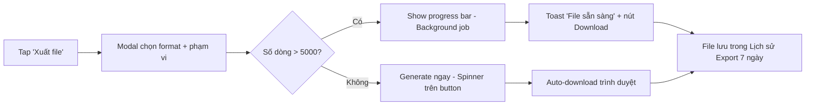

# Export UI Specification

Liên quan FR59-FR64 (Báo cáo). Vá lỗ hổng High severity từ Implementation Readiness Report 2026-04-18.

## Phạm vi xuất dữ liệu

| Loại báo cáo                   | Format hỗ trợ     | Phạm vi mặc định    |
| ------------------------------ | ----------------- | ------------------- |
| Doanh thu theo ngày/tuần/tháng | CSV, Excel (xlsx) | 30 ngày gần nhất    |
| Lãi/lỗ chi tiết                | CSV, Excel        | 30 ngày gần nhất    |
| Tồn kho hiện tại               | CSV, Excel        | Toàn bộ SP đang bán |
| Sổ chi tiết công nợ            | CSV, Excel, PDF   | Theo từng KH        |
| Lịch sử nhập kho               | CSV, Excel        | 90 ngày gần nhất    |
| Danh sách khách hàng           | CSV, Excel        | Toàn bộ KH active   |


## Vị trí nút Export

**Trên trang Báo cáo:**

- Nút "Xuất file" đặt **góc trên phải**, cạnh bộ lọc thời gian
- Style: Secondary button (outlined), icon `download` phía trước
- Mobile: thu gọn thành icon-only `download`, tooltip "Xuất file"

**Trên trang chi tiết (KH, Đơn hàng):**

- Nút "Xuất sổ chi tiết" trong dropdown "Thao tác" của trang
- Tránh chiếm chỗ action chính

## Flow xuất file (3 bước)



## Modal "Xuất báo cáo"

**Layout (mobile bottom sheet, desktop centered modal):**

```
┌────────────────────────────────────┐
│  Xuất báo cáo doanh thu       [X]  │
├────────────────────────────────────┤
│  Format file                       │
│  ( ) CSV  (•) Excel  ( ) PDF       │
│                                    │
│  Phạm vi thời gian                 │
│  [Hôm nay ▼] [01/04 - 23/04]      │
│                                    │
│  Cột muốn xuất                     │
│  [✓] Ngày                          │
│  [✓] Số đơn                        │
│  [✓] Doanh thu                     │
│  [✓] Lãi gộp                       │
│  [ ] Phương thức thanh toán        │
│                                    │
│  ☐ Nhóm theo: [Ngày ▼]            │
├────────────────────────────────────┤
│         [Hủy]   [Xuất file]        │
└────────────────────────────────────┘
```

**Quy tắc:**

- Format mặc định: **Excel** (user VN quen Excel hơn CSV)
- Cột mặc định: tất cả checked, user uncheck bớt nếu muốn
- Phạm vi thời gian: mặc định khớp filter đang chọn trên trang
- Tên file tự động: `bao-cao-doanh-thu-2026-04-23.xlsx`

## Trạng thái xử lý

**Inline (≤ 5000 dòng):**

- Click "Xuất file" → spinner trên button, label đổi thành "Đang tạo..."
- Browser tự download → Toast xanh "Đã tải file thành công"
- Thời gian: < 2 giây

**Background job (> 5000 dòng):**

- Modal đóng ngay, hiển thị banner top: "Đang xuất báo cáo... (12%)"
- Banner có nút "Hủy" và progress bar
- Khi xong: Toast với CTA "Tải xuống ngay"
- File giữ trong Lịch sử Export tối đa 7 ngày

## Lịch sử Export

Trang `/bao-cao/lich-su-export`:

| Cột        | Hiển thị                                |
| ---------- | --------------------------------------- |
| Tên file   | `bao-cao-doanh-thu-2026-04-23.xlsx`     |
| Loại       | Doanh thu / Tồn kho / Công nợ...        |
| Tạo lúc    | 23/04/2026 14:32 (relative: "2h trước") |
| Kích thước | 245 KB                                  |
| Trạng thái | Sẵn sàng / Đang xử lý / Hết hạn         |
| Hành động  | [Tải xuống] [Xóa]                       |


## Edge cases

| Tình huống             | Xử lý                                                    |
| ---------------------- | -------------------------------------------------------- |
| Offline khi click xuất | Disable nút, tooltip "Cần online để xuất file"           |
| File > 50MB            | Cảnh báo trong modal "File rất lớn, nên lọc bớt phạm vi" |
| Permission Staff       | Ẩn cột giá vốn, lãi gộp trong file CSV/Excel             |
| Background job fail    | Toast đỏ + log chi tiết, nút "Thử lại"                   |
| Export quá nhiều/giờ   | Rate limit 10 file/giờ/user, hiển thị "Đợi 5 phút"       |


## Component liên quan

- **ExportButton** — wrapper button có icon + label, handle disabled state
- **ExportDialog** — modal chọn format/cột/phạm vi
- **ExportProgressBanner** — banner top hiển thị background job
- **ExportHistoryTable** — danh sách file đã xuất

## Phím tắt (Desktop)

| Phím           | Hành động                      |
| -------------- | ------------------------------ |
| `Ctrl+E`       | Mở modal export trang hiện tại |
| `Ctrl+Shift+H` | Mở Lịch sử Export              |

