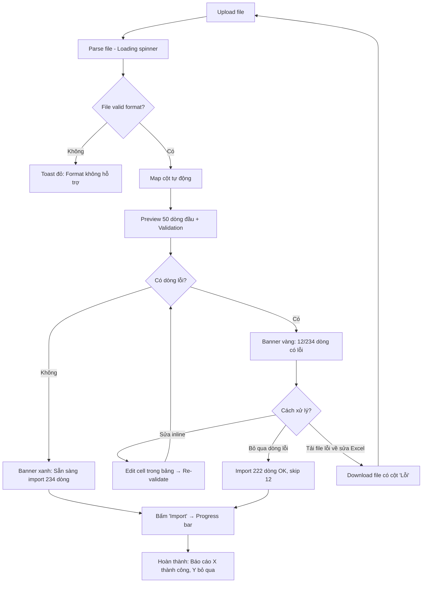

# Import Error Handling Patterns

Liên quan FR8-FR12 (Nhập hàng / Import sản phẩm). Vá lỗ hổng Medium severity từ Implementation Readiness Report 2026-04-18.

## Mục tiêu

User import file Excel/CSV sản phẩm có thể gặp dòng lỗi (mã trùng, giá âm, thiếu field bắt buộc...). UX phải:

1. Phát hiện sớm trước khi commit
2. Cho user biết chính xác dòng nào lỗi và lỗi gì
3. Cho phép sửa inline hoặc bỏ qua dòng lỗi
4. Không bao giờ ghi vào DB nếu có lỗi chưa giải quyết

## Flow tổng thể



## Cột mapping tự động

**Step 1: Auto-detect columns**

Hệ thống match column header file → field DB theo từ khóa:

| Field DB         | Headers file được nhận     |
| ---------------- | -------------------------- |
| `name`           | Tên SP, Tên hàng, Product Name, name |
| `sku`            | Mã SP, SKU, Mã hàng, code  |
| `barcode`        | Mã vạch, Barcode, EAN      |
| `cost_price`     | Giá vốn, Giá nhập, Cost    |
| `retail_price`   | Giá bán, Giá lẻ, Retail Price |
| `unit`           | Đơn vị, Unit               |
| `category`       | Nhóm, Danh mục, Category   |
| `initial_stock`  | Tồn kho, Số lượng, Stock   |

**Step 2: User xác nhận mapping**

UI hiển thị bảng mapping với dropdown cho mỗi cột file:

```
Cột trong file          → Field hệ thống
─────────────────────────────────────
"Mã SP"                 [SKU ▼]
"Tên sản phẩm"          [Tên SP ▼]
"Giá nhập"              [Giá vốn ▼]
"Giá bán lẻ"            [Giá bán ▼]
"Tồn"                   [Tồn kho ban đầu ▼]
"Ghi chú"               [Bỏ qua ▼]
```

User có thể đổi mapping nếu auto-detect sai.

## Validation rules + Error messages

| Rule                               | Error message                                          |
| ---------------------------------- | ------------------------------------------------------ |
| Tên SP rỗng                        | "Thiếu tên sản phẩm"                                   |
| SKU trùng trong file               | "SKU 'AB123' xuất hiện ở dòng 15 và 87"                |
| SKU đã tồn tại trong DB            | "SKU 'AB123' đã có sản phẩm: 'Áo thun cotton'. Cập nhật?" |
| Giá vốn ≤ 0                        | "Giá vốn phải > 0"                                     |
| Giá bán < giá vốn                  | "⚠️ Giá bán thấp hơn giá vốn (lỗ)"                     |
| Barcode trùng                      | "Mã vạch trùng với SP 'Cà phê G7'"                    |
| Tồn kho âm                         | "Tồn kho không thể âm"                                 |
| Đơn vị không có trong list         | "Đơn vị 'kg' chưa có. Tạo mới?"                        |
| Category không tồn tại             | "Nhóm 'Đồ uống' chưa có. Tạo mới?"                     |

**Phân loại severity:**

- 🔴 **Lỗi nặng** (block import dòng đó): Tên rỗng, giá vốn ≤ 0, SKU trùng trong file
- 🟡 **Cảnh báo** (cho phép import nhưng hỏi xác nhận): Giá bán < giá vốn, đơn vị/category mới
- 🔵 **Thông báo** (hiển thị nhưng không block): SKU đã tồn tại trong DB (sẽ update)

## Preview Table với Error States

**Layout:**

```
┌─────────────────────────────────────────────────────────────────┐
│  234 dòng tổng | ✓ 222 OK | ⚠ 8 cảnh báo | ✗ 4 lỗi nặng        │
│  [Lọc: Tất cả ▼] [Tải file lỗi về sửa] [Bỏ qua dòng lỗi]      │
├─────────────────────────────────────────────────────────────────┤
│  # │ Tên SP        │ SKU    │ Giá vốn │ Giá bán │ Tồn │ Lỗi   │
├─────────────────────────────────────────────────────────────────┤
│  1 │ Cà phê G7     │ CF001  │ 50.000  │ 75.000  │ 100 │ ✓     │
│  2 │ ❗ (rỗng)     │ TR002  │ 20.000  │ 30.000  │ 50  │🔴 Tên rỗng│
│  3 │ Áo thun       │ AT003  │ 100.000 │ 80.000  │ 25  │🟡 Lỗ   │
│  4 │ Bánh mì       │ BM004  │ 5.000   │ 10.000  │ 0   │✓      │
│ 87 │ Mì tôm        │ AB123  │ 5.000   │ 8.000   │ 200 │🔴 SKU trùng dòng 15│
└─────────────────────────────────────────────────────────────────┘
```

**Tính năng bảng:**

- Highlight cell lỗi: background `error-50`, border `error-500`
- Cell có warning: background `warning-50`
- Click vào cell lỗi → inline edit (input field)
- Sửa xong → blur → re-validate dòng đó ngay
- Cột "Lỗi" hiện icon + tooltip chi tiết khi hover
- Filter dropdown: "Tất cả / Chỉ lỗi / Chỉ cảnh báo / Chỉ OK"

## 3 cách xử lý lỗi

**Cách 1: Sửa inline (cho ≤ 20 dòng lỗi)**

- Tap/click cell lỗi → input mở
- Sửa → Tab/Enter để xác nhận → re-validate
- Counter cập nhật real-time: "8 dòng lỗi → 5 dòng lỗi"

**Cách 2: Tải file lỗi về sửa Excel (cho > 20 dòng lỗi)**

- Bấm "Tải file lỗi về sửa"
- File Excel có thêm cột cuối "Lỗi" mô tả vấn đề
- User sửa Excel → upload lại
- Hệ thống detect file đã sửa, merge với data đang preview

**Cách 3: Bỏ qua dòng lỗi**

- Bấm "Bỏ qua dòng lỗi" → confirm dialog
- Import chỉ các dòng OK + warning (đã accept)
- Báo cáo cuối: "Import thành công 222 sản phẩm. Bỏ qua 12 dòng (xem chi tiết)"

## Progress + Hoàn thành

**Progress (≥ 100 dòng):**

```
┌─────────────────────────────────────┐
│  Đang import sản phẩm...            │
│  ████████████░░░░░  142/234 (61%)   │
│  [Hủy import]                       │
└─────────────────────────────────────┘
```

**Hủy giữa chừng:** Rollback toàn bộ, chưa có SP nào lưu.

**Hoàn thành success:**

```
✅ Import thành công

• 222 sản phẩm mới được tạo
• 8 sản phẩm cảnh báo (đã accept)
• 4 dòng bị bỏ qua do lỗi

[Xem danh sách SP]  [Tải báo cáo import]
```

## Component liên quan

- **ImportFileDropzone** — drag-drop file area
- **ColumnMappingTable** — bảng map cột với dropdown
- **ImportPreviewTable** — bảng preview với cell editing + error highlight
- **ImportProgressModal** — progress bar background job
- **ImportSummaryReport** — báo cáo cuối cùng

## Edge cases

| Tình huống               | Xử lý                                                |
| ------------------------ | ---------------------------------------------------- |
| File > 10MB              | "File quá lớn (max 10MB). Chia nhỏ file."           |
| > 5000 dòng              | "Quá nhiều SP. Chia thành nhiều file ≤ 5000 dòng."  |
| Encoding sai (mojibake)  | "File không phải UTF-8. Mở Excel → Save as UTF-8"   |
| Cột bắt buộc không map  | Disable nút "Tiếp tục", báo "Phải map: Tên SP, Giá bán" |
| Disconnect giữa import   | Resume từ dòng đã xử lý cuối, không double-create   |
| Duplicate trong DB       | Modal hỏi: "Cập nhật / Bỏ qua / Hủy import"          |
