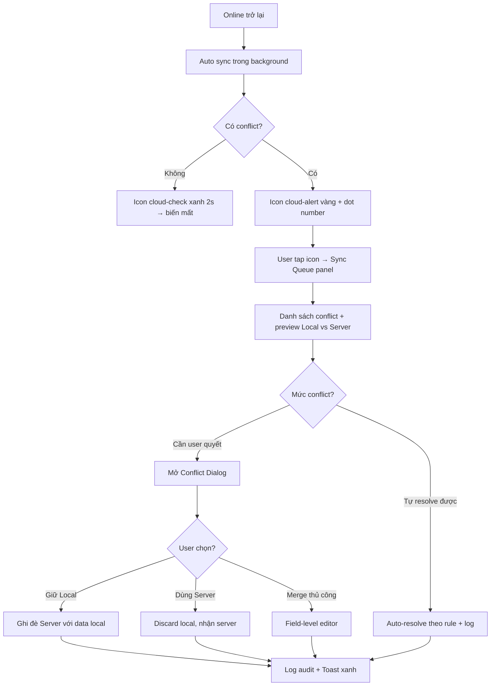

# Sync Conflict Dialog

Liên quan FR36-FR39 (Offline/Sync). Vá lỗ hổng Medium severity từ Implementation Readiness Report 2026-04-18.

## Mục tiêu

Khi thiết bị offline đồng bộ lên server, có thể xảy ra conflict (cùng SP bị sửa ở 2 thiết bị, tồn kho âm sau khi merge...). UX phải:

1. Thông báo conflict rõ ràng, không hoảng
2. Cho user biết CHÍNH XÁC field nào conflict
3. Cho phép chọn Local / Server / Merge thủ công
4. Log lại mọi quyết định để audit

## Loại conflict thường gặp

| Loại                          | Tình huống                                                  | Mức độ   |
| ----------------------------- | ----------------------------------------------------------- | -------- |
| **Update-Update**             | SP cùng SKU bị sửa giá ở 2 máy cùng lúc                     | Trung    |
| **Stock âm sau merge**        | 2 POS bán cùng SP khi offline, tổng SL > tồn kho thật       | Cao      |
| **Delete-Update**             | Máy A xóa SP, máy B sửa SP                                  | Cao      |
| **Duplicate order number**    | Offline tạo số đơn trùng với đơn server                     | Thấp     |
| **Customer debt mismatch**    | Thu nợ offline + bán chịu online cùng KH → số nợ sai        | Cao      |
| **Price list version**        | Bảng giá bị update server, POS offline vẫn dùng phiên bản cũ | Trung    |

## Flow tổng thể



## Sync Queue Panel

**Entry:** Tap icon `cloud-alert` top bar (có badge số conflict).

**Layout (mobile bottom sheet, desktop side panel):**

```
┌───────────────────────────────────────────┐
│  Đồng bộ & Xung đột              [X]      │
├───────────────────────────────────────────┤
│  ✓ 234 đơn đã sync thành công             │
│  ⚠ 3 xung đột cần xử lý                   │
│  ⏳ 5 đơn đang chờ                        │
├───────────────────────────────────────────┤
│  Xung đột                                 │
│                                           │
│  ⚠ Sản phẩm "Cà phê G7"                   │
│    Bạn sửa giá: 75.000đ (14:23)           │
│    Thiết bị khác: 80.000đ (14:25)         │
│    [Chi tiết →]                           │
│                                           │
│  ⚠ Đơn hàng #1234                         │
│    Tồn kho Cà phê: -5 sau merge           │
│    [Chi tiết →]                           │
│                                           │
│  ⚠ Công nợ KH "Anh Ba"                    │
│    Chênh lệch 500.000đ                    │
│    [Chi tiết →]                           │
└───────────────────────────────────────────┘
```

## Conflict Dialog chi tiết

**Template chung:**

```
┌──────────────────────────────────────────────┐
│  Xung đột: Sản phẩm "Cà phê G7"         [X]  │
├──────────────────────────────────────────────┤
│  Bạn và một thiết bị khác đã sửa cùng SP     │
│  này khi đang offline. Chọn bản giữ lại.     │
├──────────────────────────────────────────────┤
│  Field     │ Máy này (14:23) │ Server (14:25)│
│ ───────────┼─────────────────┼───────────────│
│  Giá vốn   │ 50.000đ         │ 50.000đ    ✓  │
│  Giá bán   │ 75.000đ ⚠       │ 80.000đ    ⚠  │
│  Tồn kho   │ 100             │ 100        ✓  │
│  Nhóm      │ Đồ uống         │ Đồ uống    ✓  │
├──────────────────────────────────────────────┤
│  Nếu bỏ qua, hệ thống giữ bản Server.        │
│                                              │
│  ( ) Giữ bản Máy này (giá 75.000đ)          │
│  (•) Giữ bản Server (giá 80.000đ)            │
│  ( ) Ghép thủ công                          │
├──────────────────────────────────────────────┤
│       [Hủy đồng bộ]    [Xác nhận]            │
└──────────────────────────────────────────────┘
```

**Highlight:**

- Field không conflict: ghi đè màu xanh `success`, icon `check`
- Field conflict: background `warning-50`, icon `!` vàng
- Giá trị đang được chọn: border xanh dày

## Chế độ Ghép thủ công (Field-level)

Khi user chọn "Ghép thủ công", mở view chi tiết field-by-field:

```
┌──────────────────────────────────────────────┐
│  Ghép thủ công: "Cà phê G7"             [X]  │
├──────────────────────────────────────────────┤
│  Giá bán                                     │
│  ( ) 75.000đ (Máy này)                       │
│  ( ) 80.000đ (Server)                        │
│  (•) Nhập giá trị khác: [77.000]đ            │
│                                              │
│  Còn 1 field cần quyết định.                 │
├──────────────────────────────────────────────┤
│         [Quay lại]   [Áp dụng]               │
└──────────────────────────────────────────────┘
```

## Conflict nghiêm trọng: Tồn kho âm

Đây là case đặc biệt cần UX riêng vì có thể ảnh hưởng nhiều đơn hàng:

```
┌──────────────────────────────────────────────┐
│  ❗ Tồn kho âm sau đồng bộ                   │
├──────────────────────────────────────────────┤
│  Sản phẩm "Cà phê G7"                        │
│  Tồn kho thực tế: 10                         │
│  Đã bán (merge): 15                          │
│  Thiếu: 5                                    │
│                                              │
│  3 đơn hàng ảnh hưởng:                       │
│  • #1230 (Máy A) — 8 lon                    │
│  • #1231 (Máy A) — 5 lon                    │
│  • #1232 (Máy B) — 2 lon ❗ thừa 5 lon       │
│                                              │
│  Cách xử lý:                                 │
│  (•) Giữ tất cả đơn, ghi chú "Nợ tồn kho"   │
│  ( ) Hủy đơn #1232                          │
│  ( ) Liên hệ KH — Tạo phiếu nhập bổ sung    │
├──────────────────────────────────────────────┤
│              [Xác nhận]                      │
└──────────────────────────────────────────────┘
```

**Quy tắc:**

- Không bao giờ tự hủy đơn đã có KH nhận hàng
- Mặc định "ghi chú nợ tồn kho" để giữ tính toàn vẹn giao dịch
- Owner được notified qua banner top để xử lý sau

## Auto-resolve rules (không hỏi user)

Một số case resolve tự động để giảm friction:

| Trường hợp                              | Rule                                      |
| --------------------------------------- | ----------------------------------------- |
| Field không đổi ở cả 2 bên              | Auto-keep, không coi là conflict          |
| Server newer + cùng user edit           | Nhận server (last-write-wins)             |
| Bảng giá có phiên bản mới trên server   | Auto-apply lên POS, báo banner thông báo  |
| Đơn hàng số trùng                       | Auto-rename local: `#1234` → `#1234-A`    |
| Customer debt: append-only transactions | Merge theo timestamp, không conflict      |

## Trạng thái Offline Indicator

Mở rộng `OfflineIndicator` thành 5 states:

| State                  | Icon            | Màu           | Tooltip                    |
| ---------------------- | --------------- | ------------- | -------------------------- |
| Online, no pending     | (không hiện)    | —             | —                          |
| Offline                | `cloud-off`     | `neutral-400` | "Đang offline"             |
| Syncing                | `cloud-sync`    | `primary-500` | "Đang đồng bộ 5 đơn..."    |
| Synced OK              | `cloud-check`   | `success-500` | "Đã đồng bộ" (hiện 2s)     |
| Conflict pending       | `cloud-alert`   | `warning-500` | "3 xung đột — tap để xem"  |
| Sync error             | `cloud-off` + ! | `error-500`   | "Lỗi đồng bộ — tap để thử" |

## Component liên quan

- **SyncQueuePanel** — danh sách pending + conflict
- **ConflictDialog** — dialog field-by-field
- **ManualMergeEditor** — view ghép thủ công
- **StockNegativeDialog** — xử lý tồn kho âm đặc biệt
- **OfflineIndicator** — mở rộng thành 5 state

## Edge cases

| Tình huống                       | Xử lý                                               |
| -------------------------------- | --------------------------------------------------- |
| Conflict liên tiếp trên cùng SP  | Gộp vào 1 dialog, không hỏi từng cái                |
| User offline lâu (> 24h)         | Banner top: "Bạn đã offline 2 ngày, đồng bộ có thể mất lâu" |
| Conflict trên dữ liệu đã xóa     | "Bản này đã bị xóa. Phục hồi hoặc bỏ qua?"          |
| Server reject do permission      | "Thiết bị khác đã thu hồi quyền sửa SP này"         |
| Máy đang offline reload          | Giữ queue trong IndexedDB, resume khi online lại    |

## Phím tắt (Desktop)

| Phím     | Hành động                  |
| -------- | -------------------------- |
| `Ctrl+S` | Mở Sync Queue panel        |
| `↑↓`     | Navigate conflict trong panel |
| `1/2/3`  | Chọn Local/Server/Merge trong dialog |
| `Enter`  | Xác nhận lựa chọn          |
