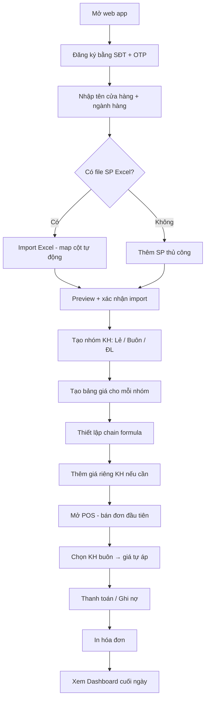
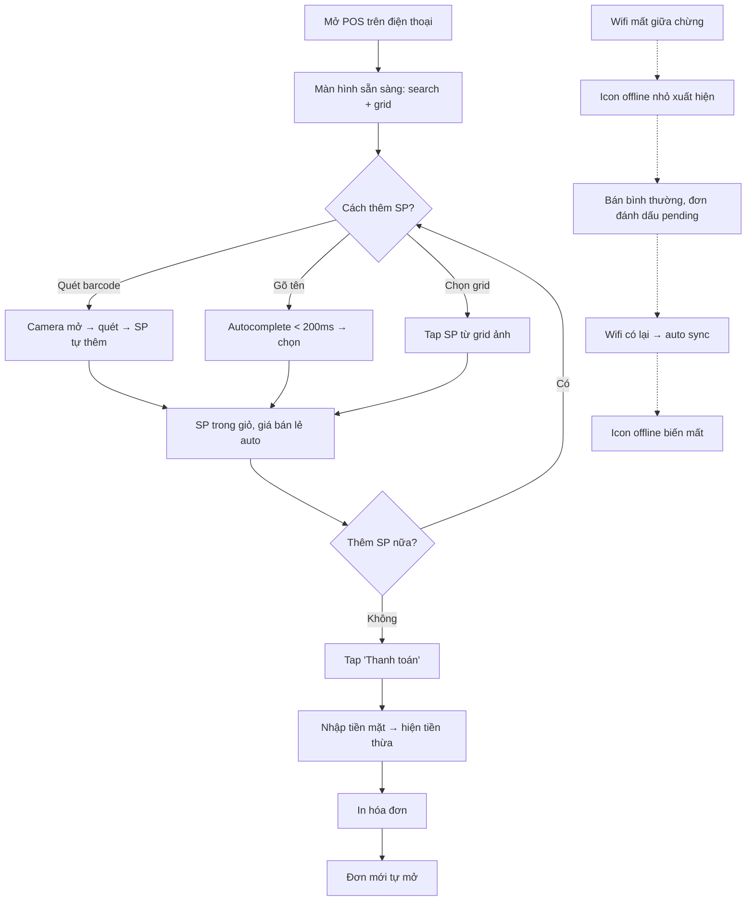
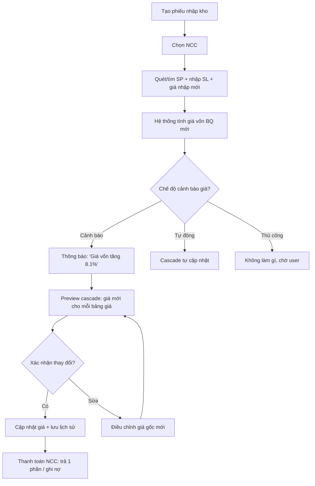
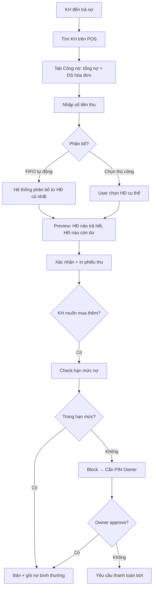

# User Journey Flows

## Journey 1: Setup & Bán buôn (Chị Hoa)

**Entry:** Đăng ký mới → Setup cửa hàng → Import SP → Tạo bảng giá → Bán hàng đầu tiên

**Điểm UX quan trọng:**

- Step B: OTP qua SMS, không cần email
- Step C: Chỉ 2 field bắt buộc (tên cửa hàng, ngành), còn lại optional
- Step E: Drag-drop file, auto-detect columns, preview trước khi commit
- Step J: UI preview cascade "Giá gốc 100k → Buôn 85k → ĐL C1 80k → ĐL C2 82k"

## Journey 2: Bán lẻ nhanh + Offline (Lan)

**Entry:** Mở POS → Quét/tìm SP → Thanh toán → Offline seamless

**Điểm UX quan trọng:**

- Step B: Không loading screen, POS sẵn sàng ngay (cached)
- Step D: Camera mở nhanh, quét liên tục (không cần bấm mỗi lần)
- Step G: Giỏ hàng kéo lên từ dưới (mobile), bên phải (tablet/desktop)
- Offline flow: Chỉ 1 icon nhỏ thay đổi, không popup/modal/warning

## Journey 3: Nhập hàng & Quản lý giá (Chị Hoa)

## Journey 4: Công nợ — Thu nợ KH (Lan + Chị Hoa)

## Pattern chung giữa các Journey

**Navigation:** Bottom tab → module chính. Detail page → back arrow phía trên.

**Feedback:**

- Thành công: Toast xanh lá ở top, tự biến mất sau 3s
- Lỗi: Toast đỏ + mô tả + gợi ý sửa, cần bấm dismiss
- Cảnh báo: Banner vàng trên đầu trang, có nút action

**Decision Points:**

- Hành động nhẹ: inline confirmation (toggle, switch)
- Hành động quan trọng: bottom sheet confirmation (ghi nợ, trả hàng)
- Hành động nguy hiểm: PIN xác nhận (sửa giá dưới vốn, override hạn mức)

---
