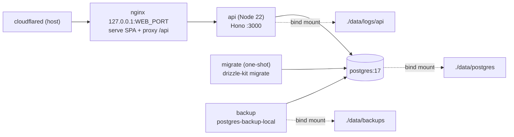

# Thiết kế: Docker Compose cho production

Ngày: 2026-06-12

## 1. Bối cảnh và mục tiêu

kiotviet-lite là monorepo pnpm gồm 2 app:

- `apps/api`: Hono + Node 22, build ra `dist/index.js`, có script `start`.
- `apps/web`: React SPA, build bằng Vite ra thư mục `dist` tĩnh.

Mục tiêu: chạy production bằng Docker Compose trên 1 server, với 3 yêu cầu:

1. Toàn bộ stack (Postgres, API, web) quản lý bằng `docker compose`.
2. Log có rotation, không đầy đĩa, đọc được trực tiếp trên host.
3. Data Postgres mount ra thư mục host, kèm backup `pg_dump` định kỳ.

## 2. Quyết định đã chốt

| Hạng mục | Quyết định |
| --- | --- |
| Service trong compose | Postgres + API + Nginx + backup, kèm job migrate one-shot |
| TLS | Nginx không lo TLS. Cloudflare Tunnel lo HTTPS |
| cloudflared | Chạy trên host, trỏ vào `localhost:${WEB_PORT}` |
| Port nginx | Cấu hình qua env `WEB_PORT` (mặc định 8080), bind `127.0.0.1` |
| Backup | Bind mount data + `pg_dump` định kỳ bằng image `prodrigestivill/postgres-backup-local` |
| Log | 2 tầng: pino-roll giữ nguyên (file ra host) + giới hạn json-file driver của Docker |

## 3. Kiến trúc

Một điểm vào duy nhất là nginx. Postgres không mở port ra host.

## 4. File tạo mới

| File | Vai trò |
| --- | --- |
| `docker-compose.prod.yml` (gốc repo) | Định nghĩa 5 service, network, bind mount, logging |
| `apps/api/Dockerfile` | Multi-stage: cài pnpm workspace, build TS, image chạy chỉ chứa prod deps |
| `apps/web/Dockerfile` | Multi-stage: build Vite với `VITE_API_URL=""` rồi copy vào `nginx:alpine` |
| `deploy/nginx.conf` | Serve SPA (fallback `index.html`), proxy `/api/` sang `api:3000`, gzip, cache asset |
| `.env.production.example` | Mẫu env cho server production |
| `.dockerignore` | Loại `node_modules`, `dist`, `data`, file env thật |
| `docs/deploy.md` | Runbook vận hành: lệnh up, xem log, backup thủ công, restore |

Không sửa code ứng dụng. Logger pino-roll hiện tại đã đáp ứng yêu cầu rotation.

## 5. Chi tiết từng service

### 5.1. postgres

- Image: `postgres:17-alpine`.
- Data: bind mount `./data/postgres:/var/lib/postgresql/data`.
- Healthcheck: `pg_isready`.
- Không expose port ra host. Chỉ network nội bộ của compose.
- `restart: unless-stopped`.

### 5.2. migrate (one-shot)

- Dùng image build từ `apps/api/Dockerfile`, stage có `drizzle-kit` và thư mục migrations.
- Chạy `drizzle-kit migrate` rồi thoát.
- `depends_on: postgres (service_healthy)`.
- Không có `restart`.

### 5.3. api

- Build multi-stage từ gốc repo (cần context gốc vì pnpm workspace).
- `NODE_ENV=production`, đọc env từ file `.env` cạnh compose trên server.
- `LOG_DIR=/app/logs`, mount `./data/logs/api:/app/logs`.
- Healthcheck: gọi `GET /api/v1/health`.
- `depends_on: migrate (service_completed_successfully)`.
- `restart: unless-stopped`.

### 5.4. web (nginx)

- Build web với `VITE_API_URL=""` để mọi request là same-origin.
- nginx serve static, fallback `index.html` cho SPA route, proxy `/api/` sang `http://api:3000`, bật gzip, cache dài cho asset có hash.
- Port: `127.0.0.1:${WEB_PORT:-8080}:80`. Không lộ ra internet, chỉ cloudflared trên host truy cập.
- `restart: unless-stopped`.

### 5.5. backup

- Image: `prodrigestivill/postgres-backup-local`.
- Lịch: `@daily`. Retention: giữ 7 bản ngày, 4 bản tuần, 6 bản tháng.
- Dump ra `./data/backups`.
- Cấu hình hoàn toàn qua biến env trong compose.
- `restart: unless-stopped`.

## 6. Log rotation (2 tầng)

1. **Tầng app**: giữ nguyên pino-roll trong `apps/api/src/lib/logger.ts`. Xoay theo ngày, tối đa 100MB/file, giữ 30 file. Mount `LOG_DIR` ra `./data/logs/api` để đọc trực tiếp trên host.
2. **Tầng Docker**: anchor `x-logging` áp cho mọi service. Driver `json-file`, `max-size: 10m`, `max-file: 3`. Log stdout của mọi container bị chặn trần, không đầy đĩa.

## 7. Backup và restore

- Data sống: `./data/postgres`. Sống sót khi container bị xoá.
- Bản dump: `./data/backups`, nén, retention tự động theo cấu hình ở mục 5.5.
- Bind mount một mình không phải backup thật. Bản dump mới là lớp bảo vệ chính.
- Lệnh restore ghi trong `docs/deploy.md`: tạo DB mới rồi `pg_restore` từ file dump.

## 8. Env production

`.env.production.example` gồm các khoá như `.env.example` hiện tại, đổi các giá trị sau:

- `DATABASE_URL`: trỏ host `postgres` (tên service trong network compose).
- `COOKIE_SECURE=true`.
- `ALLOWED_ORIGINS`: domain thật qua Cloudflare Tunnel.
- `WEB_PORT=8080`: port nginx bind trên `127.0.0.1` của host.
- Thêm các biến cho service backup (user, password, db, lịch, retention).

File `.env` thật chỉ tồn tại trên server, không commit.

## 9. Tiêu chí kiểm chứng (định nghĩa done)

1. `docker compose -f docker-compose.prod.yml up -d --build` chạy sạch trên máy local.
2. `curl localhost:8080/api/v1/health` trả 200. Mở `localhost:8080` thấy SPA hoạt động.
3. File log xuất hiện trong `./data/logs/api`.
4. Chạy backup thủ công trong container backup, thấy file dump trong `./data/backups`.
5. Restore thử file dump vào DB tạm thành công.
6. `docker inspect` xác nhận mọi container có log driver `json-file` với `max-size`.

## 10. Ngoài phạm vi

- TLS trong nginx (Cloudflare Tunnel lo).
- Chạy cloudflared trong compose.
- Đẩy backup lên cloud (S3, Drive).
- Log tập trung (Loki, ELK).
- CI/CD deploy tự động.
